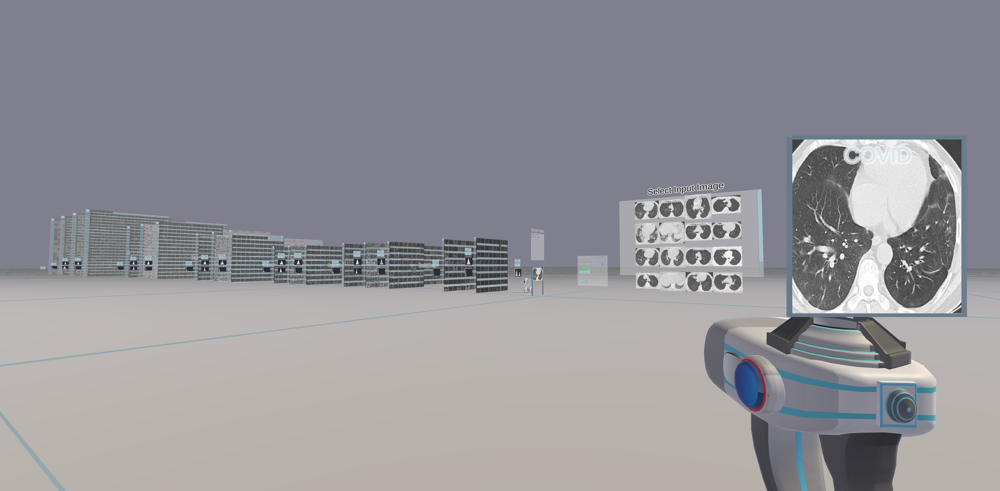

# A Walk in the Black-Box: Deep Convolutional Neural Network Visualization in Virtual Reality - Server

The [DeepVisionVR](https://github.com/Criscraft/DeepVisionVR) project visualizes deep convolutional neural networks (CNNs) in 3D. Take a walk in your CNN and interact with it to get a more intuitive understanding of Deep Learning or to analyze your models.

This repository contains the *server* part of the project, which handles the artificial neural networks and provides the client with data. The server can be run in Docker and an appropriate Dockerfile is included in the repository. The Client can be found [HERE](https://github.com/Criscraft/DeepVisionVRClient).

The software provides visualization algorithms like feature visualization to reveal what visual concepts the models have learned. Currently, CNNs for image classification and segmentation are supported.

## Requirements

For running the server you will need a Python environment that fulfills the specifications in the provided Dockerfile. We recommend to use Docker. Please install [Docker](https://www.docker.com/) and [NVIDIA-docker](https://github.com/NVIDIA/nvidia-docker). Then, build a docker image with the Dockerfile provided in the repository by executing 
    bash build.sh
On Windows I had problems to get GPU access in Docker. Therefore, I recommend to use Linux (WSL) for Windows users.

## Get started with the demo

Download the data needed for the demo from [HERE] (http://www.vision.caltech.edu/Image_Datasets/Caltech101/) and extract it at DeepVisionVR/DeepLearningServer/Datasets/Caltech 
This folder should contain the 101 folders with images of different classes. Delete the BACKGROUND_Google folder, because it is not part of the demo and will confuse the trained network that comes with the demo.

All scripts for the demo are located at DeepVisionVR/DeepLearningServer/Projects/Demo/
In order to start the Docker container and the server you may have to modify start_falcon_server.sh such that it matches your directory path. Simply change the left side of the double colon to the absolute path to the DeepLearningServer directory. 
    -v /your-absolute-path/DeepLearningServer:/DeepLearningServer

Then execute 
    bash start_falcon_server.sh

Start the [Client](https://github.com/Criscraft/DeepVisionVRClient) after the server has been started.

## How do I visualize my own architecture?

Duplicate the demo project folder in DeepVisionVR/DeepLearningServer/Projects
Replace the network or the dataset. The dataset is a simple Pytorch dataset object. However, the network needs some small modifications to be able run with DeepVisionVR. 

The software expects the networks to be a Pytorch model. The model has to contain a method called forward_features just like the model in the demo. Then, for each layer in the network that should be visualized by DeepVisionVR, you have to add a TrackerModule layer. The TrackerModule layer functions as an Identity module in Pytorch and simply serves to extract the data out of the model. 